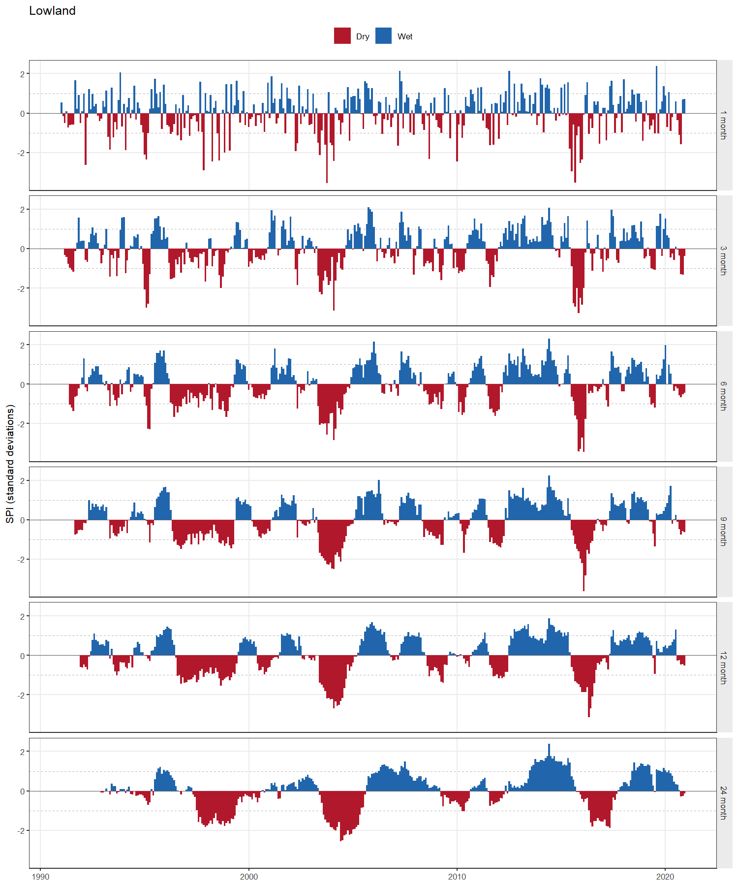
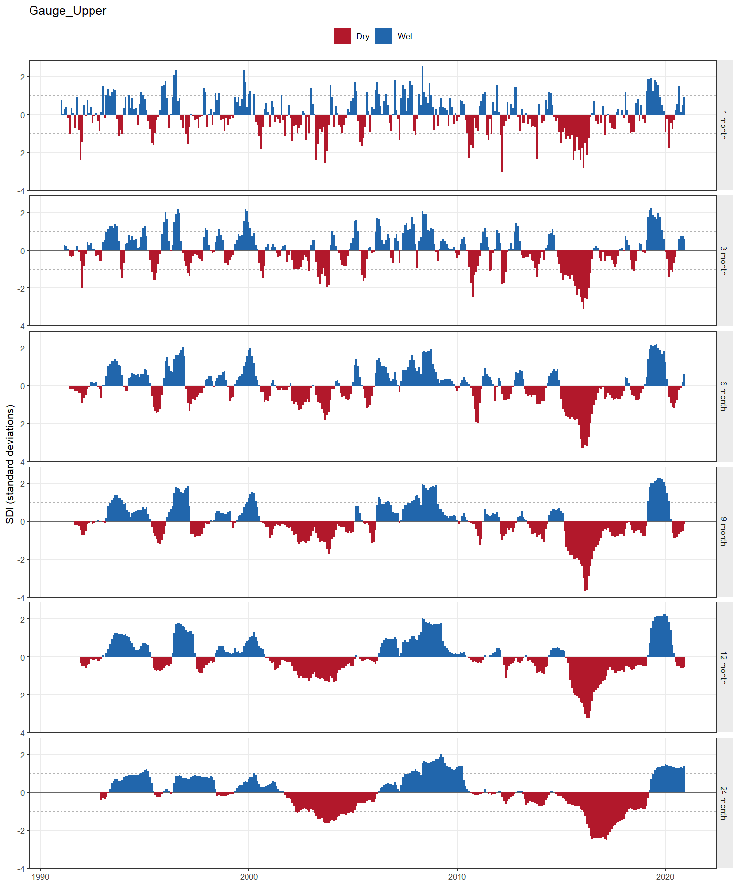

# climate-indices

Reproducible R tools for computing climate indices from station data held in a
spreadsheet. Each index is a command line script over a shared reading and
aggregation layer, so the same input conventions, gap handling and output
structure apply throughout.

[](https://github.com/majidniazkar/climate-indices/actions/workflows/ci.yml)
[](LICENSE)
[](https://www.r-project.org/)
[](https://doi.org/10.5281/zenodo.0000000)

---

## Indices available

| Index | Script | Input columns needed | Latitude required |
|---|---|---|---|
| **SPEI** — Standardized Precipitation Evapotranspiration Index | `scripts/calculate_spei.R` | Date, Temperature, Precipitation | yes (for PET) |
| **SPI** — Standardized Precipitation Index | `scripts/calculate_spi.R` | Date, Precipitation | no |
| **SDI** — Streamflow Drought Index | `scripts/calculate_sdi.R` | Date, Discharge | no |

Both are computed at any set of accumulation scales (1, 3, 6, 9, 12 and 24
months by default) and both aggregate daily input to monthly values first.
Further indices are on the [roadmap](#roadmap).

## Input format

One worksheet, one header row, columns in any order:

| Column | Meaning | Unit | Accepted header spellings |
|---|---|---|---|
| `Date` | observation date | date | `Date`, `date`, `Datum`, `Time`, `Day` |
| `Temperature` | mean air temperature | **°C** | `Temperature`, `Temp`, `Tmean`, `Tavg`, `T` |
| `Precipitation` | precipitation total | **mm** | `Precipitation`, `Precip`, `Prec`, `Rainfall`, `P` |
| `Discharge` | daily mean discharge | **m³/s** (any consistent unit) | `Discharge`, `Flow`, `Streamflow`, `Runoff`, `Q`, `Qobs` |

Each script asks only for the columns its index needs — SPI for `Date` and
`Precipitation`, SDI for `Date` and `Discharge` — so a two-column sheet is
accepted as is. Header matching ignores case, spaces, dots and underscores. Real Excel
date cells are preferred; dates stored as text are parsed from the common
formats (`YYYY-MM-DD`, `DD.MM.YYYY`, `DD/MM/YYYY`, …).

Rows may be daily or already monthly — the frequency is detected from the
spacing of the dates, and `--input-frequency` overrides the guess. Gaps are
allowed: missing days reduce a month's coverage, and missing months are
carried as explicit gaps rather than closed up.

Ready-to-run examples are in [`data/example/`](data/example/).

## Installation

Requires R ≥ 4.1. Install the R packages once:

```r
source("install_dependencies.R")
```

That installs `readxl`, `writexl`, `SPEI` and `optparse`, plus `ggplot2` if
you want figures.

## SPI

```bash
Rscript scripts/calculate_spi.R --input precipitation.xlsx
```

No latitude and no temperature: SPI has no evapotranspiration term. With
`--sheet all`, every worksheet in the workbook is processed and the output
carries one sheet per station.

| Option | Default | Meaning |
|---|---|---|
| `-i`, `--input` | — | Path to the input `.xlsx` **(required)** |
| `-s`, `--scales` | `1,3,6,9,12,24` | Accumulation scales, in months |
| `-o`, `--output-dir` | `output` | Where results are written |
| `--sheet` | `1` | Worksheet name, 1-based index, or `all` |
| `--min-coverage` | `0.9` | Fraction of a month's days that must be observed |
| `--input-frequency` | `auto` | `auto`, `daily` or `monthly` |
| `--distribution` | `Gamma` | Distribution fitted to the accumulation |
| `--fit` | `ub-pwm` | `ub-pwm`, `pp-pwm` or `max-lik` |
| `--ref-period` | whole record | Fixed fitting window, e.g. `1991-01:2020-12` |
| `--no-zero-correction` | off | Leave zero-precipitation months undefined |
| `--prefix` | `monthly_spi` | Base name for the output files |
| `--plot` | off | Also write a PNG per worksheet |
| `--no-csv` | off | Write only the `.xlsx` |
| `-q`, `--quiet` | off | Suppress progress messages |

```bash
Rscript scripts/calculate_spi.R \
  --input data/example/synthetic_daily_precipitation.xlsx \
  --sheet all --plot
```



## SDI

```bash
Rscript scripts/calculate_sdi.R --input discharge.xlsx --sheet all
```

Needs date and daily discharge only. Options match SPI, with `--distribution`
taking `log-normal` (default), `gamma` or `normal`, and `--prefix` defaulting
to `monthly_sdi`.

**Choose the distribution deliberately.** Nalbantis & Tsakiris write SDI as
the standardised anomaly of cumulative flow, *(V − V̄) / s*, and then note
that streamflow volumes are usually skewed, for which they prescribe the
two-parameter log-normal variant — take natural logarithms first. That
distinction is not cosmetic. On the example `Gauge_Upper` record (360 months,
monthly skewness 3.0), SDI-1 below −2 should occur in about 2.3 % of months,
roughly 8:

| Variant | Skewness of the index | Months below −1.5 (expect ~24) | Months below −2 (expect ~8) | Maximum |
|---|---|---|---|---|
| `log-normal` | −0.18 | 25 | 10 | +2.57 |
| `normal` | +1.21 | 5 | **0** | +3.98 |

The plain anomaly inherits the skew of the flow data, so its dry tail is
compressed and its wet tail stretched: it reports *no* extreme-drought month
in thirty years while reaching +3.98 on the wet side. Use `normal` only to
reproduce results computed that way.



## SPEI

```bash
Rscript scripts/calculate_spei.R --input mystation.xlsx --latitude 48.891
```

Latitude is in decimal degrees, negative in the southern hemisphere;
Thornthwaite PET needs it to compute day length. Options are the same as for
SPI, with `--latitude` added, `--distribution` defaulting to `log-Logistic`,
`--prefix` to `monthly_pet_spei`, and no `--sheet all` or zero-correction flag
(the water balance is not bounded at zero, so neither applies).


Shorter scales respond to single dry months; longer ones aggregate a
multi-year deficit. The dashed lines mark ±1, the conventional threshold for
moderate drought.

Either script prints its full option list with `--help`, and runs from any
working directory. To work with the intermediate objects in an R session
instead, see [`examples/`](examples/).

## Output

`<output-dir>/<prefix>.xlsx` holds:

- **one sheet of monthly results** — `Monthly_SPEI` for SPEI, or one sheet per
  input worksheet for SPI. Columns: `Date`, `Year`, `Month`, `Days_In_Month`,
  the per-month observation counts, the monthly `Temperature` (°C) and
  `Precipitation` (mm), `PET` and `Balance` (mm, SPEI only), and one
  `SPI_<scale>` / `SPEI_<scale>` column per scale.
- **Category_Summary** — months per wet/dry class at each scale, following
  McKee et al. (1993): *extremely / severely / moderately dry*, *near normal*,
  *moderately / very / extremely wet*.
- **Metadata** — input file, scales, distribution, fit method, reference
  period, coverage threshold, zero handling, record span, R and SPEI
  versions, and the run timestamp, so a result file states how it was made.

The monthly tables are also written as `.csv` unless `--no-csv` is given, and
`--plot` adds a `.png`.

The first *scale − 1* months of each index column are empty: an *n*-month
accumulation is undefined until *n* months have been observed.

## Method notes and limitations

### Both indices

- **These are not z-scores.** A standardised index is the normal deviate with
  the same cumulative probability as the accumulated total under a fitted
  distribution, and the distribution is fitted **separately for each calendar
  month**. Subtracting a mean and dividing by a standard deviation instead
  leaves the seasonal cycle in the result and misstates the skew, and the two
  diverge exactly where drought monitoring operates — in the tail.
- **Magnitudes beyond about ±3 are extrapolation.** With a 30-year record the
  most extreme month the sample itself can resolve is roughly ±1.9; anything
  further comes from the fitted distribution's tail, not from observed
  frequencies. Treat the class label (*extremely dry*) as the finding and the
  precise value as indicative.
- **Record length.** The index standardises against the distribution fitted to
  the record itself, so a short record gives unstable extremes. 30 years or
  more is the usual recommendation; both scripts warn below that and still run.
- **Reference period.** By default the fit uses the whole record, so adding new
  years changes earlier values slightly. Pass `--ref-period` to fix the
  fitting window and keep a series comparable between runs.
- **Coverage rule.** A month assembled from fewer than `--min-coverage` of its
  days is reported as missing. Without such a rule a month with no
  observations sums to 0 mm, which an index reads as an extreme drought.
- **Scales longer than the record** are reported and skipped rather than
  producing an all-empty column.

### SPI

- **Zero-precipitation months** need care: the gamma distribution has no
  density at zero, so a zero accumulation sits at cumulative probability zero
  and the index comes back as −∞. This tool applies the conventional mixed
  distribution of Edwards & McKee (1997), *H(x) = q + (1 − q)·G(x)*, where *q*
  is the observed frequency of zero accumulations in that calendar month and
  *G* is a gamma fitted by the Thom (1958) estimator to the positive ones. A
  zero then maps to the finite value *Φ⁻¹(q)*. Calendar months treated this
  way are listed in the run log and the correction is recorded in the
  Metadata sheet; `--no-zero-correction` disables it. A calendar month that is
  dry in *every* year of the record has no defined SPI and is left empty.

### SDI

- **Accumulation windows.** The original paper evaluates SDI over the
  hydrological year at four fixed reference periods. This implementation uses
  overlapping monthly windows instead, as SPI and SPEI do and as the later SDI
  literature generally does, so the three indices here are comparable month by
  month. Results are therefore not identical to a four-period-per-year
  implementation.
- **Zero-flow months** on an intermittent gauge carry a finite probability
  mass that neither the log-normal nor the gamma distribution can represent;
  they are handled as in SPI, *H(x) = q + (1 − q)·G(x)*, so a no-flow month
  maps to *Φ⁻¹(q)* rather than −∞. The `normal` variant needs no such
  treatment. A calendar month that never flows in any year is left empty.
- **Monthly totals of daily mean discharge** are used, not volumes. The two
  differ by a constant factor within a calendar month, which a standardised
  index removes, so the result is the same as working in m³.
- **Class boundaries.** The shared −1 / −1.5 / −2 thresholds coincide with
  Nalbantis & Tsakiris's moderate, severe and extreme drought states. Their
  "mild drought" band (−1 < SDI < 0) is not separated out here; it falls
  inside *near normal*.

### SPEI

- **Thornthwaite PET is temperature-only.** It needs just monthly mean
  temperature and latitude, which is what makes a three-column input file
  sufficient. It is also the crudest of the usual PET formulations and tends
  to overestimate demand in arid climates. With wind, humidity and radiation
  available, Penman–Monteith (`SPEI::penman`) is preferable; that is on the
  roadmap.

The example datasets are **synthetic** — generated to exercise the code, not
observations of any real place.

## Running from Python or Jupyter

The calculation is R, but it drives cleanly from Python as a subprocess, which
avoids the R-in-Python setup entirely:

```python
import subprocess, pandas as pd

subprocess.run([
    "Rscript", "scripts/calculate_sdi.R",
    "--input", "discharge.xlsx", "--sheet", "all",
], check=True)

monthly = pd.read_csv("output/monthly_sdi_Gauge_Upper.csv", parse_dates=["Date"])
```

Use [`rpy2`](https://rpy2.github.io/) only if you need the R objects
themselves.

## Repository layout

```
R/                     reusable modules
  climate_io.R         workbook reading, column resolution, validation, writing
  monthly.R            daily to monthly aggregation on a continuous grid
  classify.R           wet/dry classes and category summaries, shared
  pet.R                potential evapotranspiration
  spei_index.R         SPEI
  spi_index.R          SPI, including the zero-inflation correction
  sdi_index.R          SDI, with selectable distribution
  plot_index.R         figures
scripts/               command line entry points, one per index
tests/run_tests.R      unit tests
data/example/          synthetic example workbooks
examples/              the same pipelines step by step, for an R session
```

An index is added as one module under `R/` plus one script under `scripts/`;
reading, aggregation, classification, output and plotting are already shared.
A new input variable is one row in `MONTHLY_STATISTIC` in `R/monthly.R`, which
declares whether it is averaged or summed over the month, plus its accepted
header spellings in `R/climate_io.R`.

## Tests

```bash
Rscript tests/run_tests.R
```

69 checks covering aggregation, calendar alignment, the coverage rule, PET,
the standardisation of all three indices, the per-calendar-month fit, the
zero-flow treatment, the distribution variants, the drought classification and
input validation.
The same suite plus end-to-end runs on the example datasets executes in CI on
every push.

## Roadmap

Planned for later releases, each as a module beside the existing ones:

- Additional PET methods: Hargreaves (needs Tmin/Tmax), Penman–Monteith
- Temperature and precipitation extremes indices (ETCCDI subset)
- Aridity and continentality indices
- Optional NetCDF/gridded input alongside spreadsheets

## Citation

If this code contributes to a publication, please cite the repository (see
[`CITATION.cff`](CITATION.cff) or the *Cite this repository* button on GitHub)
**and** the underlying methods:

- Nalbantis, I. & Tsakiris, G. (2009). Assessment of hydrological drought
  revisited. *Water Resources Management*, 23(5), 881–897.
  <https://doi.org/10.1007/s11269-008-9305-1> — SDI
- McKee, T.B., Doesken, N.J. & Kleist, J. (1993). The relationship of drought
  frequency and duration to time scales. *Proceedings of the 8th Conference on
  Applied Climatology*, 179–184. — SPI
- Edwards, D.C. & McKee, T.B. (1997). *Characteristics of 20th century drought
  in the United States at multiple time scales.* Climatology Report 97-2,
  Colorado State University. — zero-inflation correction
- Vicente-Serrano, S.M., Beguería, S. & López-Moreno, J.I. (2010). A
  multiscalar drought index sensitive to global warming: the Standardized
  Precipitation Evapotranspiration Index. *Journal of Climate*, 23(7),
  1696–1718. <https://doi.org/10.1175/2009JCLI2909.1> — SPEI
- Thornthwaite, C.W. (1948). An approach toward a rational classification of
  climate. *Geographical Review*, 38(1), 55–94.
  <https://doi.org/10.2307/210739> — PET
- Beguería, S. & Vicente-Serrano, S.M. *SPEI: Calculation of the Standardised
  Precipitation-Evapotranspiration Index.* R package.
  <https://CRAN.R-project.org/package=SPEI>

## License

MIT — see [LICENSE](LICENSE).
