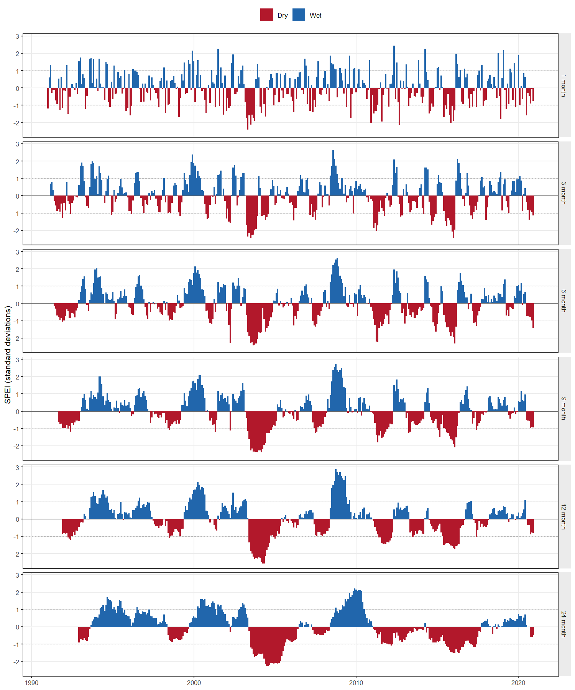

# climate-indices

Reproducible R tools for computing climate indices from station data held in a
spreadsheet. The first release computes the **Standardized Precipitation
Evapotranspiration Index (SPEI)** at multiple accumulation scales, together
with Thornthwaite potential evapotranspiration and the monthly climatic water
balance. Further indices will be added in later releases.

[](https://github.com/majidniazkar/climate-indices/actions/workflows/ci.yml)
[](LICENSE)
[](https://www.r-project.org/)
[](https://doi.org/10.5281/zenodo.0000000)

---

## What it does

Given one worksheet of daily (or monthly) **date, mean temperature and
precipitation**, the tool:

1. reads and validates the workbook, reporting the row that is wrong rather than failing obscurely;
2. aggregates daily values to monthly means (temperature) and totals (precipitation) on a continuous calendar grid;
3. computes monthly potential evapotranspiration (PET) by the Thornthwaite (1948) method from temperature and site latitude;
4. forms the climatic water balance *D = P − PET*;
5. fits SPEI at every requested accumulation scale (1, 3, 6, 9, 12, 24 months by default);
6. writes a multi-sheet workbook, a CSV copy, and optionally a figure.

## Input format

One worksheet, one header row, three columns in any order:

| Column | Meaning | Unit | Accepted header spellings |
|---|---|---|---|
| `Date` | observation date | date | `Date`, `date`, `Datum`, `Time`, `Day` |
| `Temperature` | mean air temperature | **°C** | `Temperature`, `Temp`, `Tmean`, `Tavg`, `T` |
| `Precipitation` | precipitation total | **mm** | `Precipitation`, `Precip`, `Prec`, `Rainfall`, `P` |

Header matching ignores case, spaces, dots and underscores. Real Excel date
cells are preferred; dates stored as text are parsed from the common formats
(`YYYY-MM-DD`, `DD.MM.YYYY`, `DD/MM/YYYY`, …).

Rows may be daily or already monthly — the frequency is detected from the
spacing of the dates, and `--input-frequency` overrides the guess. Gaps are
allowed: missing days reduce a month's coverage, and missing months are
carried as explicit gaps rather than closed up.

A ready-to-run example is in [`data/example/`](data/example/).

## Installation

Requires R ≥ 4.1. Install the R packages once:

```r
source("install_dependencies.R")
```

That installs `readxl`, `writexl`, `dplyr`, `SPEI` and `optparse`, plus
`ggplot2` if you want figures.

## Usage

```bash
Rscript scripts/calculate_spei.R --input mystation.xlsx --latitude 48.891
```

The two required arguments are the workbook and the site latitude in decimal
degrees (negative in the southern hemisphere); Thornthwaite PET needs the
latitude to compute day length. Everything else has a default:

| Option | Default | Meaning |
|---|---|---|
| `-i`, `--input` | — | Path to the input `.xlsx` **(required)** |
| `-l`, `--latitude` | — | Site latitude, decimal degrees **(required)** |
| `-s`, `--scales` | `1,3,6,9,12,24` | SPEI accumulation scales, in months |
| `-o`, `--output-dir` | `output` | Where results are written (created if absent) |
| `--sheet` | `1` | Worksheet name or 1-based index |
| `--min-coverage` | `0.9` | Fraction of a month's days that must be observed for the month to be used |
| `--input-frequency` | `auto` | `auto`, `daily` or `monthly` |
| `--distribution` | `log-Logistic` | Distribution fitted to the accumulated balance |
| `--fit` | `ub-pwm` | Parameter estimation: `ub-pwm`, `pp-pwm` or `max-lik` |
| `--ref-period` | whole record | Fit on a fixed reference period, e.g. `1991-01:2020-12` |
| `--prefix` | `monthly_pet_spei` | Base name for the output files |
| `--plot` | off | Also write a PNG of the SPEI series |
| `--no-csv` | off | Write only the `.xlsx` |
| `-q`, `--quiet` | off | Suppress progress messages |

`Rscript scripts/calculate_spei.R --help` prints the same list.

The script runs from any working directory. To work with the intermediate
objects in an R session instead, see
[`examples/spei_quickstart.R`](examples/spei_quickstart.R).

### Example

```bash
Rscript scripts/calculate_spei.R \
  --input data/example/synthetic_daily_climate.xlsx \
  --latitude 48.891 --plot
```



Shorter scales respond to single dry months; longer ones aggregate a
multi-year deficit. The dashed lines mark SPEI = ±1, the conventional
threshold for moderate drought.

## Output

`<output-dir>/<prefix>.xlsx` holds three sheets:

- **Monthly_SPEI** — one row per month: `Date`, `Year`, `Month`,
  `Days_In_Month`, `N_Days_Temperature`, `N_Days_Precipitation`,
  `Temperature` (°C), `Precipitation` (mm), `PET` (mm), `Balance` (mm) and one
  `SPEI_<scale>` column per scale.
- **Category_Summary** — months per wet/dry class at each scale, following
  McKee et al. (1993): *extremely / severely / moderately dry*, *near normal*,
  *moderately / very / extremely wet*.
- **Metadata** — input file, latitude, scales, distribution, fit method,
  reference period, record span, R and SPEI versions, and the run timestamp,
  so a result file states how it was produced.

The same monthly table is written as `.csv` unless `--no-csv` is given, and
`--plot` adds `<prefix>.png`.

The first *scale − 1* months of each `SPEI_<scale>` column are empty: an
*n*-month accumulation is undefined until *n* months have been observed.

## Method notes and limitations

- **Thornthwaite PET is temperature-only.** It needs just monthly mean
  temperature and latitude, which is what makes a two-variable input file
  sufficient. It is also the crudest of the usual PET formulations and tends
  to overestimate demand in arid climates. With wind, humidity and radiation
  available, Penman–Monteith (`SPEI::penman`) is preferable; that is on the
  roadmap below.
- **Record length.** SPEI standardises against the distribution fitted to the
  record itself, so a short record gives unstable extremes. 30 years or more is
  the usual recommendation; the tool warns below 30 years but still runs.
- **Scales longer than the record** are reported and skipped rather than
  producing an all-empty column.
- **Coverage rule.** A month assembled from fewer than `--min-coverage` of its
  days is reported as missing. Without such a rule a month with no
  observations sums to 0 mm of precipitation, which an index reads as an
  extreme drought.
- **Reference period.** By default the distribution is fitted to the whole
  record, so adding new years changes earlier values slightly. Pass
  `--ref-period` to fix the fitting window and keep a series comparable
  between runs.
- The example dataset is **synthetic** — generated to exercise the code, not
  observations of any real place.

## Running from Python or Jupyter

The calculation is R, but it can be driven from Python through
[`rpy2`](https://rpy2.github.io/):

```python
import subprocess
subprocess.run([
    "Rscript", "scripts/calculate_spei.R",
    "--input", "mystation.xlsx", "--latitude", "48.891",
], check=True)

import pandas as pd
monthly = pd.read_csv("output/monthly_pet_spei.csv", parse_dates=["Date"])
```

Calling the script as a subprocess and reading the CSV avoids the R-in-Python
setup entirely; use `rpy2` only if you need the R objects themselves.

## Tests

```bash
Rscript tests/run_tests.R
```

27 checks covering aggregation, calendar alignment, the coverage rule, PET,
SPEI standardisation, the drought classification and input validation. The
same suite plus an end-to-end run on the example dataset executes in CI on
every push.

## Roadmap

Planned for later releases, each as a module beside `R/spei_index.R` reusing
the same input and aggregation layer:

- SPI (precipitation only, no PET required)
- Additional PET methods: Hargreaves (needs Tmin/Tmax), Penman–Monteith
- Temperature and precipitation extremes indices (ETCCDI subset)
- Aridity and continentality indices
- Optional NetCDF/gridded input alongside spreadsheets

## Citation

If this code contributes to a publication, please cite the repository (see
[`CITATION.cff`](CITATION.cff) or the *Cite this repository* button on GitHub)
**and** the underlying methods:

- Vicente-Serrano, S.M., Beguería, S. & López-Moreno, J.I. (2010). A
  multiscalar drought index sensitive to global warming: the Standardized
  Precipitation Evapotranspiration Index. *Journal of Climate*, 23(7),
  1696–1718. <https://doi.org/10.1175/2009JCLI2909.1>
- Beguería, S. & Vicente-Serrano, S.M. *SPEI: Calculation of the Standardised
  Precipitation-Evapotranspiration Index.* R package.
  <https://CRAN.R-project.org/package=SPEI>
- Thornthwaite, C.W. (1948). An approach toward a rational classification of
  climate. *Geographical Review*, 38(1), 55–94.
  <https://doi.org/10.2307/210739>
- McKee, T.B., Doesken, N.J. & Kleist, J. (1993). The relationship of drought
  frequency and duration to time scales. *Proceedings of the 8th Conference on
  Applied Climatology*, 179–184.

## License

MIT — see [LICENSE](LICENSE).
